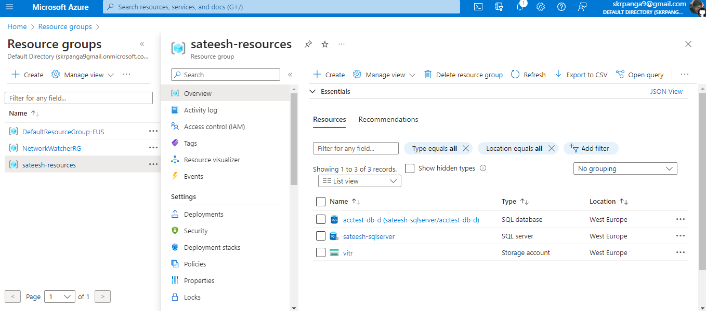

### TASKS IN TERRAFORM
1.write a template to Create Vnet with 6subnets
2.write a template to Create 2 Vnets with each 6 subnets using count and length function
3.write a template to Create virtual machine
4.Write a template for the backend to take backup of the state file
5.write a template to create 2 vms with nginx and apache by attch loadbalancer
6.Create a module

## I Have Practiced in terraform

# Creating Virtual Network Using Following Terraform File
---
provider "azurerm"{
    features {}
}
resource "azurerm_resource_group" "sateeshrg" {
  location = "eastus"
  name     = "sateesh-rg"
}

resource "azurerm_virtual_network" "sateeshvnet" {
  name                = "sateesh-vnet"
  resource_group_name = "sateesh-rg"
  address_space       = ["10.0.0.0/16"]
  location            = "eastus"
  #depends_on = [
    #azurerm_resource_group.ntierrg
  #]

}
---

# Creating Virtual Network By Using Variables
---
terraform {
  required_version = ">= 1.0.0"
  required_providers {
    azurerm = {
      source  = "hashicorp/azurerm"
      version = ">= 3.48.0"
    }
  }
}

provider "azurerm"{
    features {}
}

resource "azurerm_resource_group" "nagrg" {
  location = var.location
  name     = "nag-rg"
}

resource "azurerm_virtual_network" "nagvnet" {
  name                = "nag-vnet"
  resource_group_name = "nag-rg"
  address_space       = var.vnet-range
  location            = var.location
  #depends_on = [
    #azurerm_resource_group.ntierrg
  #]

}
---

Above .tf file using Input files 
---
variable "location" {
  type        = string
  default     = "eastus"
  description = "location to create resource"
}

variable "vnet-range" {
  type        = list(string)
  default     = ["10.0.0.0/16"]
  description = "cidr range of vnet"
}
---

using var.tfvars files 
---
location = "eastus"
vnet-range = [ "10.100.0.0/16" ]
---

## CREATED SQLSERVER DATABASE
---
provider "azurerm" {
  features {}
}
resource "azurerm_resource_group" "sateesh" {
  name     = "sateesh-resources"
  location = "West Europe"
}

resource "azurerm_storage_account" "vitr" {
  name                     = "vitr"
  resource_group_name      = azurerm_resource_group.sateesh.name
  location                 = azurerm_resource_group.sateesh.location
  account_tier             = "Standard"
  account_replication_type = "LRS"
}

resource "azurerm_mssql_server" "sateesh" {
  name                         = "sateesh-sqlserver"
  resource_group_name          = azurerm_resource_group.sateesh.name
  location                     = azurerm_resource_group.sateesh.location
  version                      = "12.0"
  administrator_login          = "4dm1n157r470r"
  administrator_login_password = "4-v3ry-53cr37-p455w0rd"
}

resource "azurerm_mssql_database" "test1" {
  name           = "acctest-db-d"
  server_id      = azurerm_mssql_server.sateesh.id
  sku_name       = "Basic"

  tags = {
    foo = "bar"
  }
}

---
